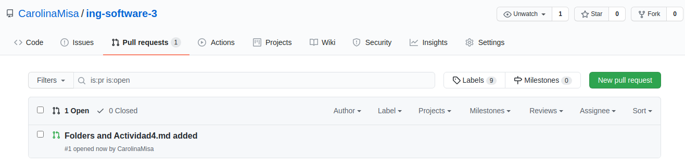
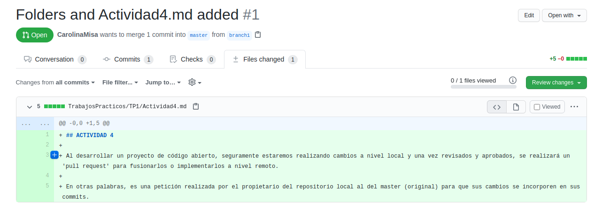
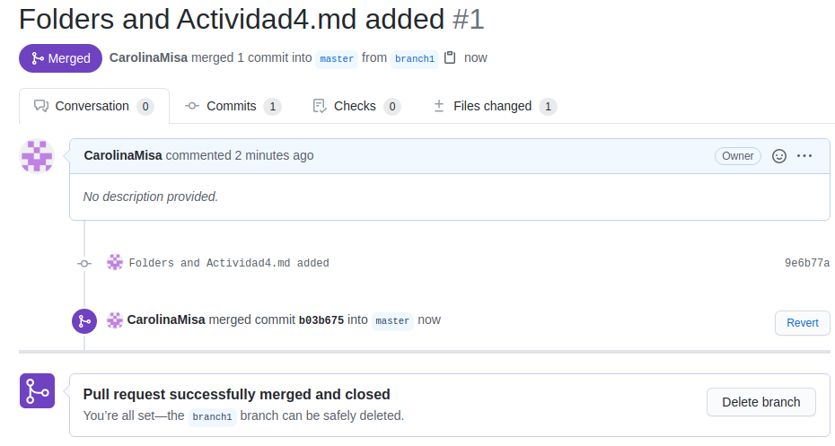

## ACTIVIDAD 4

Al desarrollar un proyecto de código abierto, seguramente estaremos realizando cambios a nivel local y una vez revisados y aprobados, se realizará un 'pull request' para fusionarlos o implementarlos a nivel remoto.

En otras palabras, es una petición realizada por el propietario del repositorio local al del master (original) para que sus cambios se incorporen en sus commits.

 

 

