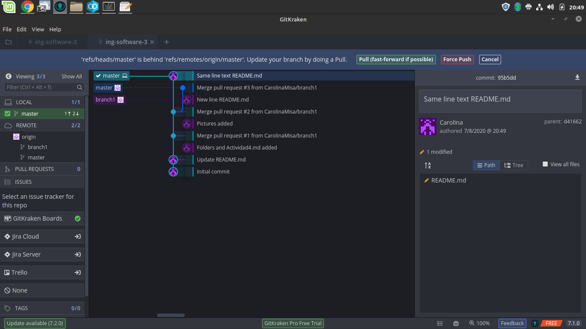
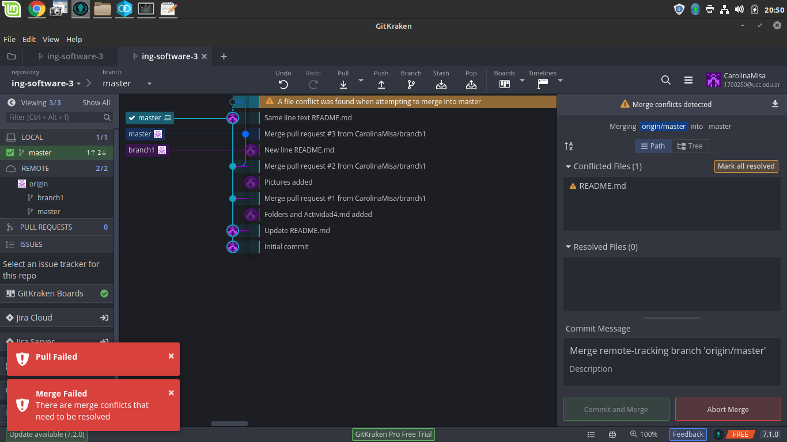
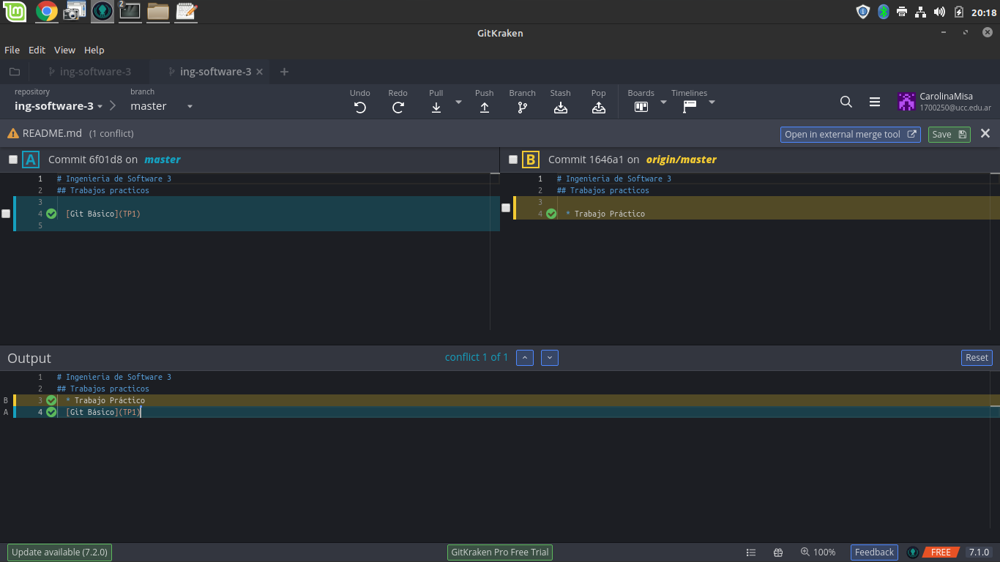

## ACTIVIDAD 5

  * Error al intentar pushear el repositorio clonado en un segundo directorio.

    

  * Al hacer el pull alerta los conflictos de código

      

 * Resolviendo el conflicto de código

       

# VERSIONES

  * LOCAL: Archivos en la rama donde se está mergeando.
  * REMOTE: Archivos de la rama desde la que se esta mergeando. 
