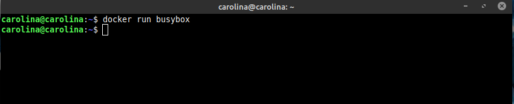
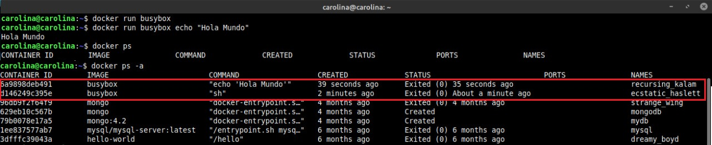

## ACTIVIDAD 4

  

Como se puede observar no obtuvimos resultados porque no indicamos el comando correspondiente para ser ejecutado.

A continuacion, ejecutamos un comando dentro del contenedor y luego listamos los contenedores ejecutados:

  

El primer comando (docker ps) lista solo los contenedores que estan corriendo y el segundo, donde agreamos la flag -a (--all), muestra todos los contenedores.
