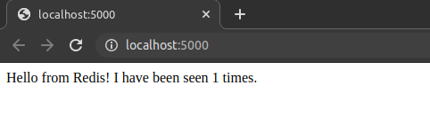

## ACTIVIDAD 2

Esta API, conectada a la base de datos Redis, posee un contador que es incrementado al visitar el endpoint en ‘/’.

Los parámetros –e definen variables de entorno. En el punto anterior es utilizada para configurar el host y el puerto de Redis.

Al eliminar el contenedor y volver a levantarlo el contador no se ha reiniciado, ya que solo hemos borrado la app web. Ahora, si ejecuto `docker rm -f db` y lo levanto nuevamente lograré borrar los hits registrados.

Como posible solución, Docker permite crear volúmenes de datos para guardar información independientemente de los contenedores
