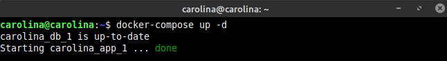
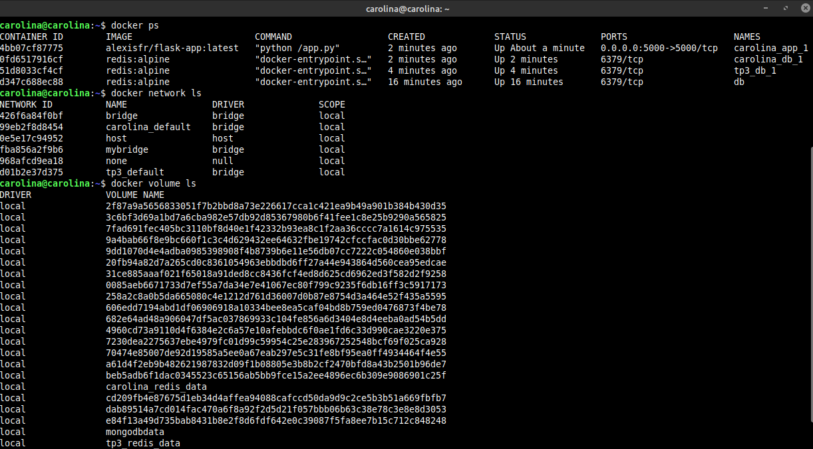
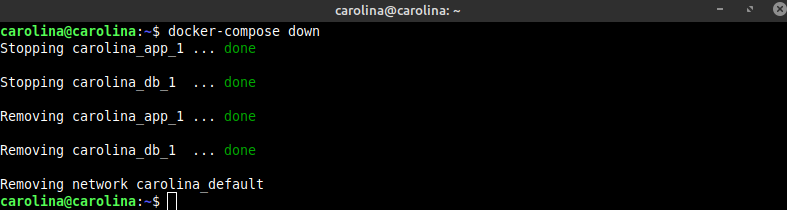

## ACTIVIDAD 3

# Utilizando Docker compose
   
   
   

A partir del archivo `docker-compose.yml` , definimos los servicios a correr, la red interna para que estos se comuniquen y un volumen de datos. Básicamente, nos facilitó la tarea de ejecución de los puntos anteriores. 
