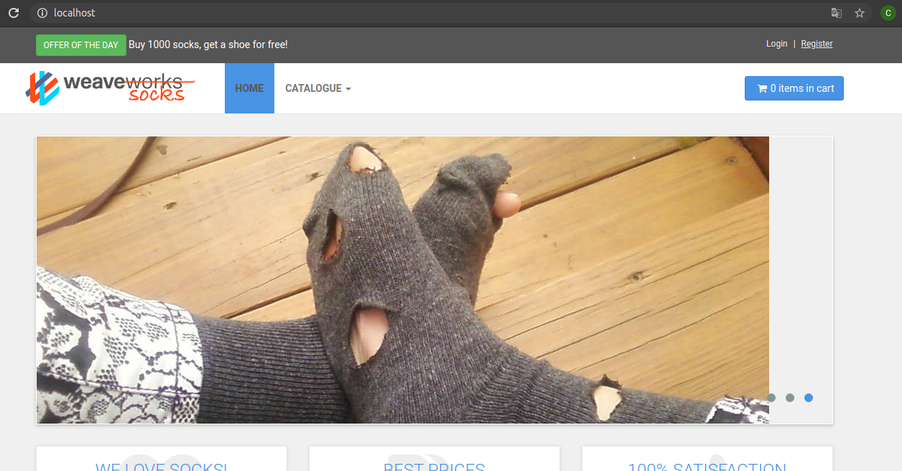
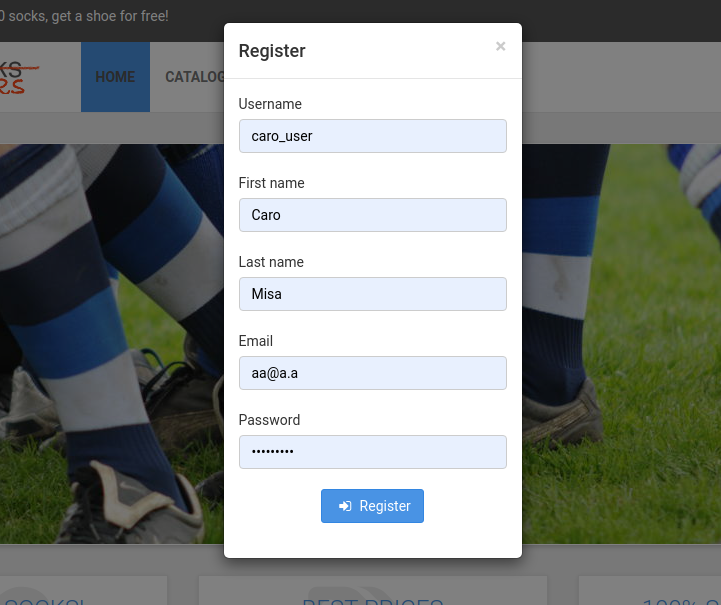
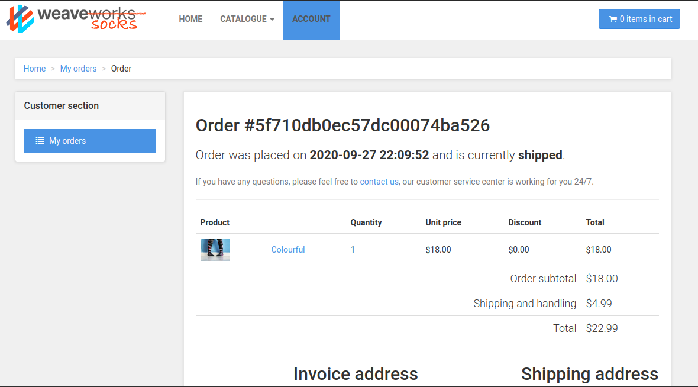
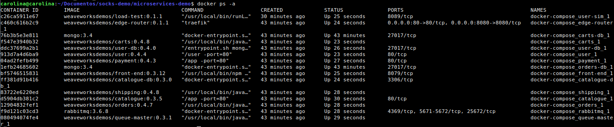
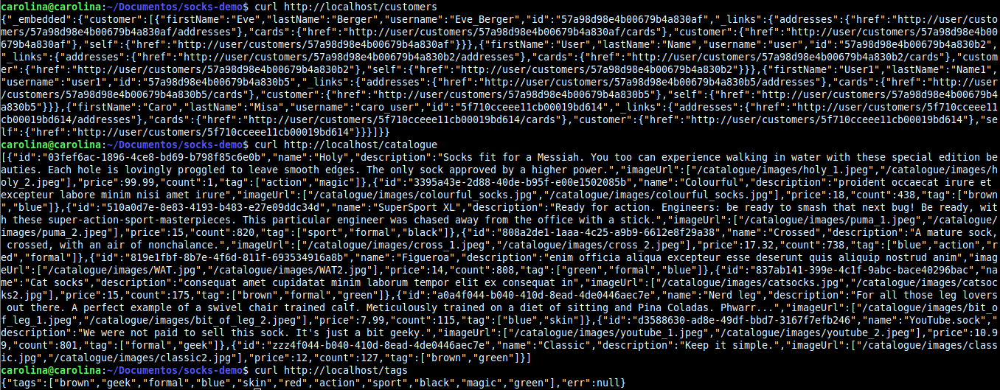

## ACTIVIDADES – WeaveSocks

# Algunas capturas del proceso de instanciación del sistema:
   
   
   
   
# Investigación de los componentes

1. Describa los contenedores creados, indicando cuales son los puntos de ingreso del sistema

  

  Tal como se observa en la imagen, los contenedores con los que cuenta el sistema son:
  
   * **edge-router:** funciona como invocador del front-end.
   * **carts, user, payment, shipping, catalogue, orders:** son las distintas APIs del sistema.
   * **front-end:** API que invoca a las demás para generar las vistas
   * **rabitmq:** el *“middleware de distribución de mensajes”* entre aplicaciones.
   * **queue-master:** gestor de la cola de mensajes.
   * **user-db, catalogue-db:** bases de datos de las APIs

  
2. ¿Por qué cree usted que se está utilizando repositorios separados para el código y/o la configuración del sistema? Explique puntos a favor y en contra.

4. ¿Cuál contenedor hace las veces de API Gateway?

    Este es el contenedor Front-end.

Al ejecutar estos comandos:

   

6. ¿Cuál de todos los servicios está procesando la operación?

  En el caso de ```curl http://localhost/customers``` , ```user``` procesa ```/customers```.
  En el caso de ```curl http://localhost/catalogue```  y ```curl http://localhost/tags```, ```catalogue``` procesa ambos, ```/catalogue``` y ```/tags```.

8. ¿Como persisten los datos los servicios?

  Los datos son almacenados en los contenedores base de datos correspondiente vistos en el punto 1.

9. ¿Cuál es el componente encargado del procesamiento de la cola de mensajes?
 
 Este es el queue-master.
  
10. ¿Qué tipo de interfaz utilizan estos microservicios para comunicarse?
