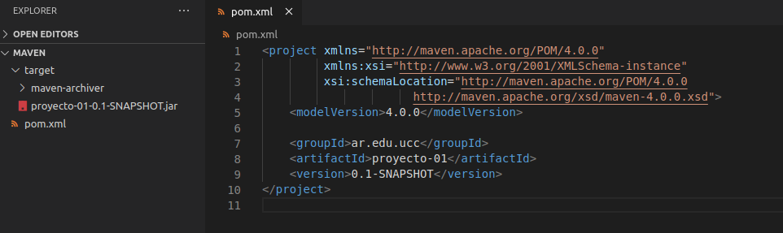

## INTRODUCCIÓN A MAVEN

### Qué es Maven?

Maven es una herramienta de software diseñada para facilitar la tarea de crear y gestionar proyectos en Java. 
Tal como se define en su documentación, su principal objetivo es "*permitir que un desarrollador comprenda el estado completo de su trabajo en el menor tiempo posible*". Para ello, Maven se ocupa de:

- *Facilitar el proceso de construcción*
- *Proporcionar un sistema de construcción uniforme*
- *Proporcionar información de calidad sobre los proyectos*
- *Fomentar mejores prácticas de desarrollo*

### Qué es el archivo POM?

POM significa "Project Object Model". Consiste en una representación XML de la información del proyecto y sus detalles de configuración necesarios para construirlo (build). 
Entre sus elementos básicos encontramos:

- **modelVersion:** versión del proyecto descripto en el POM. Mientras se use Maven 3 debe estar seteado en 4.0.0.
- **groupId:** es único, identifica nuestro grupo de proyecto entre todos los proyectos.
- **artifactId:** nombre que identifica al proyecto.
- **versionId:** versión del artefacto (proyecto) del grupo. Permite llevar un registro de los cambios, o versiones, en el código.

### Repositorios

Un repositorio en Maven es donde se encuentran los artefactos, estructurados de cierta forma, para hacer la descarga de las dependencias.

- **Repositorio Local:** es un directorio que hace de cache para descargas remotas y contiene artefactos temporales necesarios para construir nuestro proyecto.
- **Repositorio Central:** consiste en un repositorio donde se alojan todos los componentes que son utilizados por la comunidad que trabaja con JDK.
- **Repositorio Remoto:** hace referencia a cualquier otro tipo de repositorio que pueden ser accedidos y descargados para implementarlos.

### Entender Ciclos de vida de build

Maven proporciona un ciclo de vida de contrucción claramente definido para que el desarrollador gestione agil y rapidamente la configuración de su proyecto Maven.
Hay tres ciclos de vida establecidos:

- **default:** encargado del deployment del proyecto.
- **clean:** encargado limpiar los archivos y directorios generados por Maven durante el build. 
- **site:** encargado de la creación del proyecto y su documentación. 


El comando ```mvn clean install``` generó el jar correspondiente al POM.
   
   
