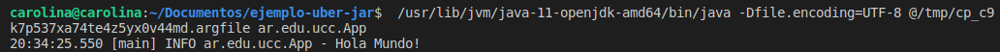

## MANEJO DE DEPENDENCIAS

Al agregar la libreria de loggin nos topamos con un error al intentar compilar: no estan cargadas sus dependencias en el pom.xml.

Una vez modificado, funciona exitosamente.

