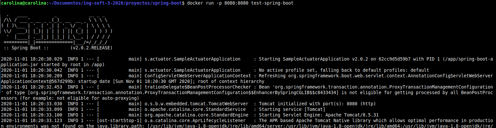
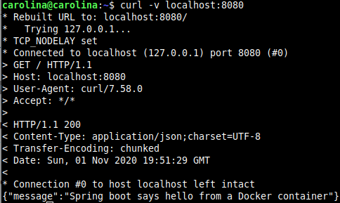
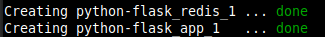
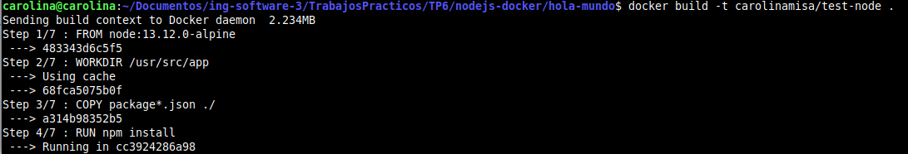
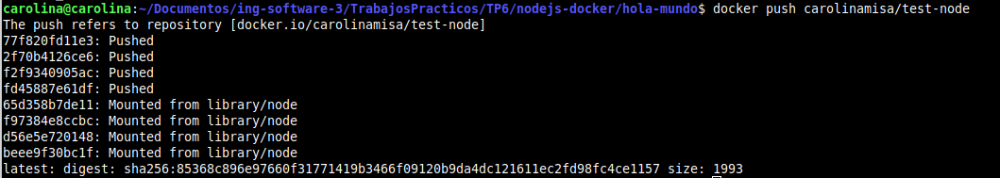
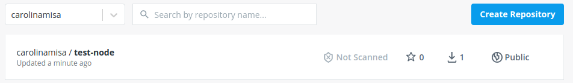

## CONCEPTOS DE DOCKERFILES

- **FROM:** inicializa una nueva etapa de construcción y establece la imagen base para instrucciones posteriores. 
- **RUN:** ejecuta cualquier comando sobre la imagen deseada.
- **ADD:** copia archivos, directorios o URL de archivos remotos y los agrega al sistema de archivos de la imagen.
- **COPY:**  copia archivos o directorios y los agrega al sistema de archivos del contenedor. (**NO ARCHIVOS REMOTOS**)
- **EXPOSE:**  informa a Docker que el contenedor escucha en los puertos especificados durante su ejecución.
- **CMD:** proporciona valores predeterminados para un contenedor en ejecución. Solo puede haber una instrucción CMD en un Dockerfile.
- **ENTRYPOINT:** permite configurar un contenedor que se ejecutará como ejecutable.

## GENERAR IMAGEN DE DOCKER

Ejecutando el contenedor `test-spring-boot` 

   
   
Si lo corremos en otra terminal nos muestra el mensaje `Spring boot says hello from a Docker container`

   

## DOCKERFILES MULTI ETAPAS

A continuación explicare brevemente como se estructura el dockerfile multi-stage:

- Comienza especificando los archivos que deben copiarse para descargar las dependencias necesarias para la ejecución del sistema.

```
FROM maven:3.5.2-jdk-8-alpine AS MAVEN_TOOL_CHAIN
COPY pom.xml /tmp/
RUN mvn -B dependency:go-offline -f /tmp/pom.xml -s /usr/share/maven/ref/settings-docker.xml
```
- Luego, buildeamos el proyecto copiando previamente los archivos fuente.

```
COPY src /tmp/src/
WORKDIR /tmp/
RUN mvn -B -s /usr/share/maven/ref/settings-docker.xml package
```
- Y por último, ejecutamos la aplicación.

```
FROM java:8-jre-alpine

EXPOSE 8080

RUN mkdir /app
COPY --from=MAVEN_TOOL_CHAIN /tmp/target/*.jar /app/spring-boot-application.jar

ENV JAVA_OPTS="-Xms32m -Xmx128m"

ENTRYPOINT exec java $JAVA_OPTS -Djava.security.egd=file:/dev/./urandom -jar /app/spring-boot-application.jar

HEALTHCHECK --interval=1m --timeout=3s CMD wget -q -T 3 -s http://localhost:8080/actuator/health/ || exit 1
```

## PYTHON FLASK

Al correr el comando `docker-compose up -d` creo la aplicacion en Python y su Redis correspondiente. 



La key `build.context` especifica la ruta del dockerfile para hacer el build.


## IMAGEN PARA APLICACION WEB EN NODEJS

Build de la imagen `test-node`



(El dockerfile se encuentra en la carpeta correspondiente - `nodejs-docker/hola-mundo`)

## PUBLICAR LA IMAGEN EN DOCKER HUB



La imagen fue publicada con exito.




