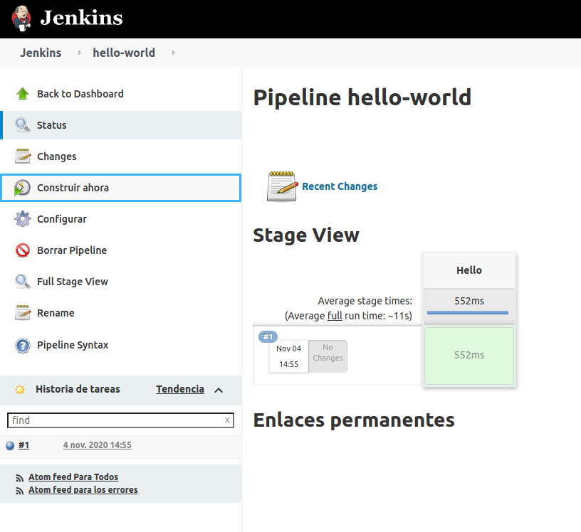
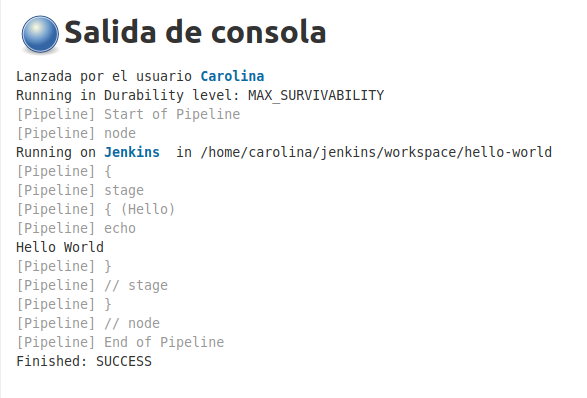
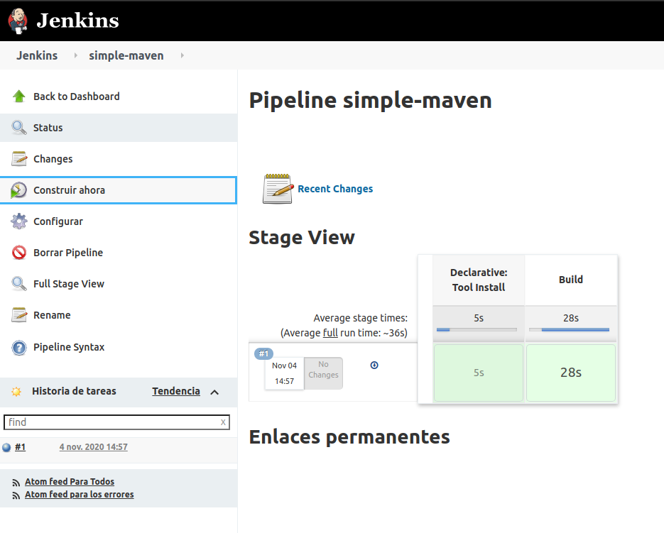
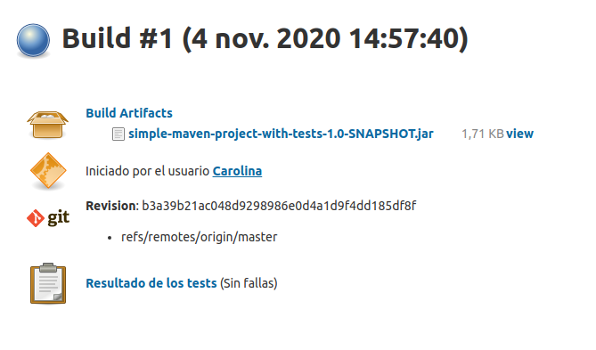
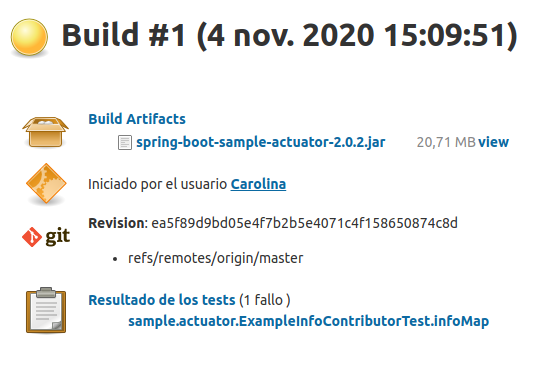
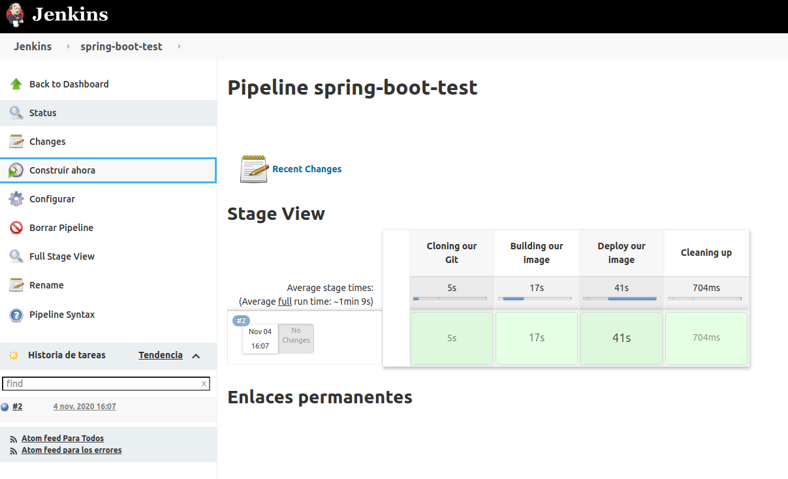
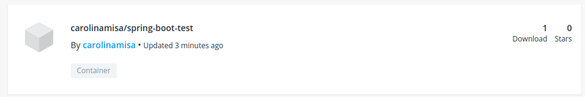

## CREANDO EL PRIMER PIPELINE JOB

- Pipeline hello-world
 
 
 
 
  
## CREANDO UN PIPELINE JOB CON GIT Y MAVEN

- Pipeline Git + Maven
 
 
 
 
 
 ## UTILIZANDO NUESTROS PROYECTOS - [Repositorio Spring boot](https://github.com/CarolinaMisa/spring-boot-IS3)
 
 
 
 ## UTILIZANDO NUESTROS PROYECTOS CON DOCKER
 
  
  
  
  
