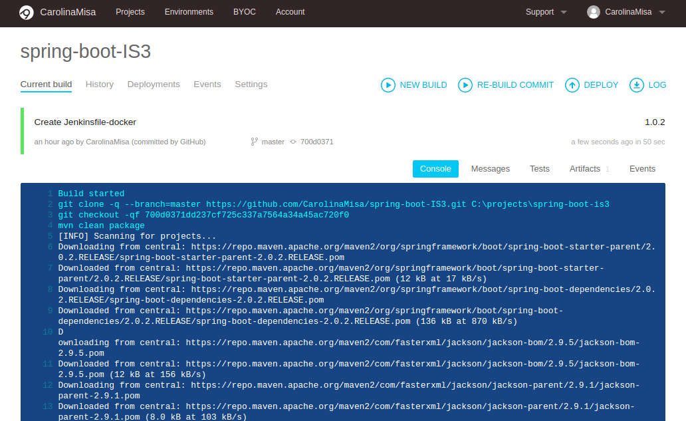
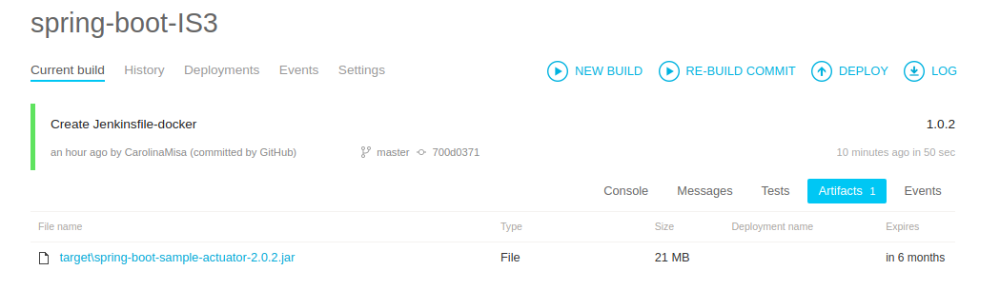
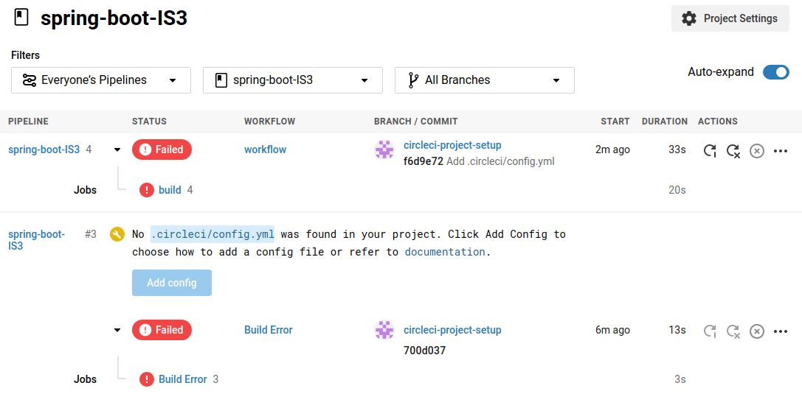
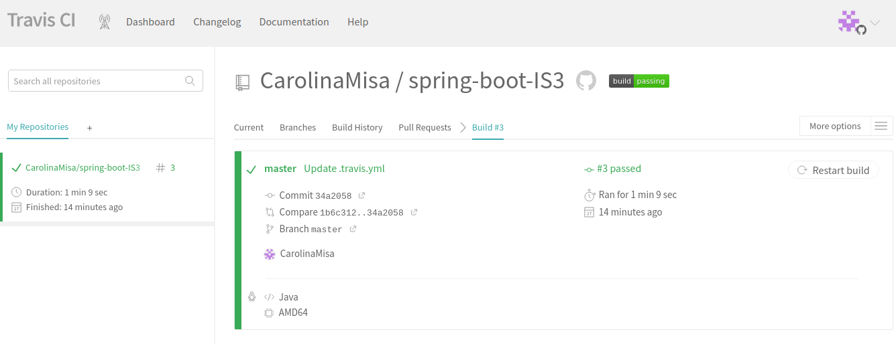
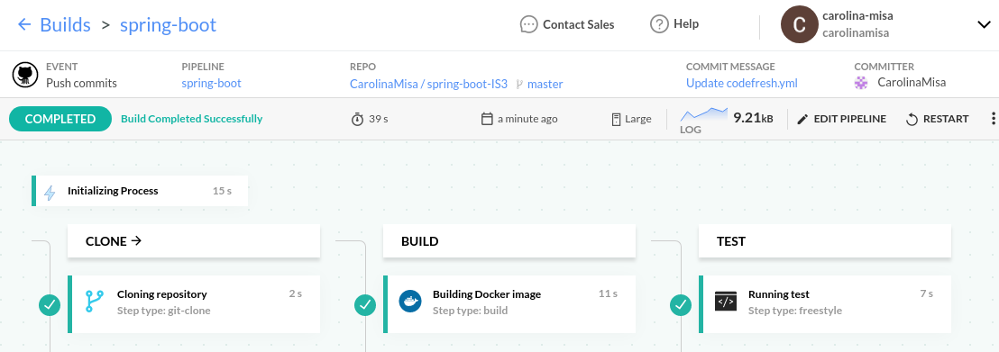
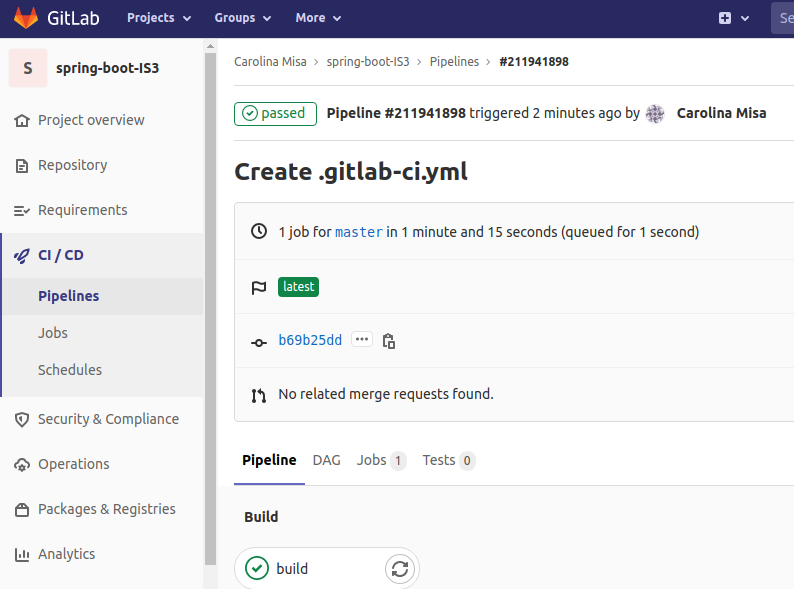

### HERRAMIENTAS DE CONSTRUCCIÓN DE SOFTWARE EN LA NUBE

## PROS Y CONTRAS

Las herramientas de integracion continua presentan multiples **ventajas**, como por ejemplo:

* Reducir la complejidad de proyectos largos: facilitan tareas de mantenimiento y actualización, automatizando la construccion del software en incrementos de menor tamano.
* Las pruebas automatizadas reducen el tiempo empleado para la deteccion de errores.
* Escalabilidad.

**Desventajas:**

* Las organizaciones que las implementen deberan confiar su proyecto y seguridad del mismo a tecnologias ajenas a ellas.
* La posibilidad de usarlas dependen de su disponibilidad, llevando asi a cierta dependencia de la organizacion y la herramienta.

Los .yml correspondientes a cada herramienta se encuentran en el [Repositorio Spring boot](https://github.com/CarolinaMisa/spring-boot-IS3)

## CONFIGURANDO AppVeyor
 
 
 
 
 
 ## CONFIGURANDO CircleCI
 
  
  
 ## CONFIGURANDO TravisCI
 
  
 
 ## CONFIGURANDO Codefresh
 
   

## CONFIGURANDO Gitlab

   

## CONCLUSIONES

Si bien para realizar los pipelines me base en la documentacion de las respectivas herramientas, tuve inconvenientes con el config.yml en CircleCI que no pude solucionar.
En cuanto a la interfaz que ofrecen, encontre mucho mas facil de usar Codefresh y TravisCI pero todas las trabajadas cuentan con mucha documentacion e informacion que ayudan a aquellos que no las conociamos y nos topamos con algunos problemas en el camino (sobre todo al armar los .yml de cada uno)
