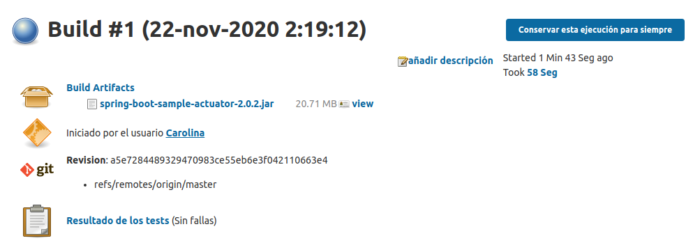
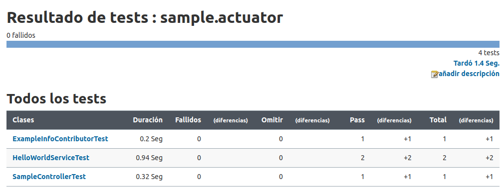

### PRUEBAS DE UNIDAD

## Utilizando Unit test

La siguiente dependencia importa los modulos para tests, como por ejemplo JUnit, y otras librerias utiles para el proyecto.

```xml
		<dependency>
			<groupId>org.springframework.boot</groupId>
			<artifactId>spring-boot-starter-test</artifactId>
			<scope>test</scope>
		</dependency>
```

El test paso correctamente.


## Utilizando Mocks

Para realizar este apartado modifique el archivo POM.xlm agregando esta dependencia para rear los objetos mock.

```xml
<dependency>
   			<groupId>org.mockito</groupId>
    		<artifactId>mockito-core</artifactId>
    		<version>2.22.0</version>
    		<scope>test</scope>
</dependency>
```

El test paso correctamente.


## CAPTURAR LOS UNIT TESTS COMO PARTE DEL PROCESO DE CI/CD





